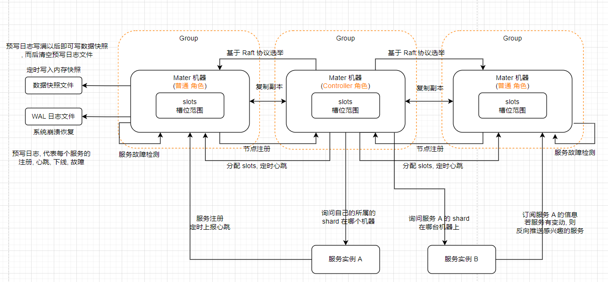

## 微服务注册中心

该项目的目标是实现一个高可用高性能的微服务注册中心, 架构如果所示

> **服务节点角色**:
>
> **候选节点**: 用于选举Controller的节点
>
> **普通节点**: 不参与Controller 选举, 用于均衡负载

### 1. 当前实现的功能有:

1. 集群controller选举, 选举算法参考ZK做了简单实现:
   - 节点启动时都会向其他候选节点发送投票, 首先投票给自身节点. 
   - 此时第一轮投票必定不会有结果, 因为没有一个节点可以得到多数票. 此时处理的关键在于下一票应该投向哪个节点, ZK实现是首先看轮次 epoch, 再看 ZXID ,最后看 myid. 而当前系统仅做了简单实现: 首先看轮次 epoch, 再看节点id. 最终大部分节点都会收敛于同一个节点, 即可顺利完成选举
2. 集群数据分片及副本高可用, 数据分片参考Redis Cluster 集群槽位分配实现, 即集群会将16384个槽位均匀分配到集群节点, 每个节点负责一部分槽位(主分片). 同时为了解决单点故障引起的数据丢失问题, 还增加了副本机制, 即将某个节点负责的主分片数据复制一份或多份存储到其他节点
3. 客户端注册, 订阅 及 服务心跳功能. 客户端启动时首先连接到任意一个服务节点拉起元数据, 元数据包含了每个服务节点负责存储的槽位信息. 待客户端发起注册时, 首先通过哈希算法得到槽位slot, 然后根据槽位去元数据找到匹配的服务节点, 然后向该节点发起注册请求. 注册完成后, 客户端启动心跳机制, 定时更新该服务的最近更新时间. 同时服务器有心跳机制, 不断检测注册表的服务实例最近更新时间是否已经超出了指定时间, 若超出则移除该实例. 
4. 注册转发及心跳转发: 客户端发起注册请求到服务端时, 有可能是集群做了重新选举, 分片数据也做了调整, 而客户端并未来得及同步. 此时客户端的请求节点实际已经发生变化, 此时就需要服务节点根据当前分片信息转发到实际的机器上进行处理.

### 2. 待完成

**系统高可用机制**:

2.1 服务端高可用

1. 若某个候选节点断开连接, 此时需要询问大多数节点的观察情况再做处理. 多数确认宕机后则需要判断宕机节点是否是controller节点, 若是则重新选举并分摊宕机节点负责的主分片及副本分片, 否则仅需分摊宕机节点负责的主分片及副本分片数据.
2. 某个候选节点宕机后, 若此时客户端发送的请求需要判断请求数据主分片所在节点是否存在
     2.1 若主分片存在则可以执行读写操作(写操作时仍需考虑多数派算法)
       2.2 若主分片节点已宕机则判断其副本分片是否存在. 该场景下只能处理读请求.
       2.3 若副本存在则到指定机器读取后返回
3. 主分片写入数据时, 是多数节点写入成功后才算完成, 还是只要主分片写入完成即可,而后通过异步的方式通知其他副本写入(若是存储系统则需深入考虑)

2.2 客户端高可用: 即集群宕机恢复后, 考虑如何将元数据推送到客户端

### 3. Controller选举问题

目前controller选举是一种参考zk的简单选举算法, 后续可使用 [sofa-jraft](https://github.com/sofastack/sofa-jraft) 基于Raft协议的具体实现替代
1. 选举过程中必须三个及以上节点才可以产生leader, 而zookeeper在仅有两个节点时也可以产生leader.
另外, zk 各个节点之间是如何发起新一轮选举, 是否有必要通知其他各节点同步当前选举轮次?
2. 各个候选节点互联成功后, 是否有必要发送心跳给对方, 已确保master在线?
3. 候选节点宕机或网络断开后如何重新发起选举？

### 优化
1. 请求接收及发送队列可以考虑使用 Disruptor 高性能无锁队列
2. Leader选举功能可使用 JRaft 实现
